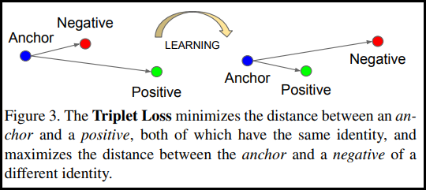

# Triplet-loss-pytorch
Implement triplet-loss

## Introduction


The triplet loss is a great choice for classification problems with N_CLASSES >> N_SAMPLES_PER_CLASS. For example, face recognition problems.


The CNN architecture we use with triplet loss needs to be cut off before the classification layer. In addition, a L2 normalization layer has to be added.

## Usage
```
python train.py
python extract_embeddings.py
python model_on_top.py
```
You should change --data-path with your own path
</br>
The default model is set to resnet18
## Data
Download dataset [here](https://download.csdn.net/download/qq_43391414/20023207) 
</br>
I use dogs vs cats here for demo

## Results

</br>
KNN: 0.9825</br>
SVM: 0.985</br>
Linear SVM: 0.985 </br>
RF: 0.9825</br>

## Acknowledgement
Thanks for great inspiration from [https://github.com/alfonmedela/triplet-loss-pytorch/tree/master](https://github.com/alfonmedela/triplet-loss-pytorch/tree/master) and [https://github.com/chencodeX/triplet-loss-pytorch](https://github.com/chencodeX/triplet-loss-pytorch)

## License
All code within the repo is under [MIT license](https://mit-license.org/)


